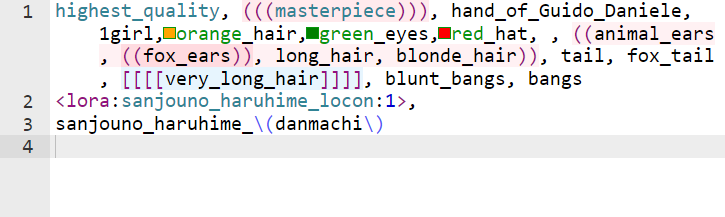

[](https://www.python.org/downloads/)
[](https://nodejs.org/)
[![License]](https://github.com/a2569875/sd-webui-prompt-highlight/blob/main/LICENSE)
#  Stable Diffusion WebUI Prompt Highlight Plugin



### Language
* [繁體中文](README.zh-tw.md)  

# Installation

Go to \[Extensions\] -> \[Install from URL\] in webui and enter the following URL:
```
https://github.com/a2569875/sd-webui-prompt-highlight.git
```
Install and restart to complete installation.

# Features
* 1. Syntax highlighting for prompts
  - Neural network, keyword, quality adjustment syntax, and weight adjustment symbol highlighting
  - Color prompt
  - (optional) Weight highlighting
  - Show invisible characters
  - Support for txt2img and img2img
  - Can switch highlighting modes

* 2. Find and replace prompts
  - Support for regex searches

* 3. If [lora-prompt-tool](https://github.com/a2569875/lora-prompt-tool) is installed:
  - Double-clicking the neural network syntax can quickly add a model trigger word

# Development
## Installation
If you want to develop the project, you need to prepare [Node.js](https://nodejs.org/) first.

After installing Node.js, run the following command in this directory:
```
python install.py --dev
```
to complete the installation.

## Compilation
The prompt syntax rules are defined in [src/sdprompt_highlight_rules.js](src/sdprompt_highlight_rules.js).

Run the following command to compile:
```
python build_ace.py
```