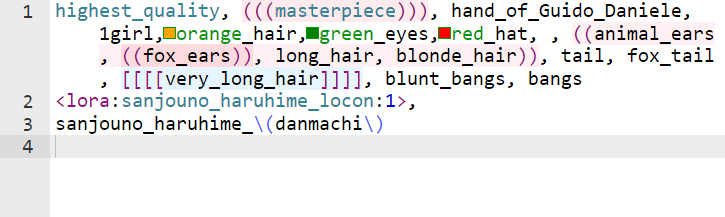

[](https://www.python.org/downloads/)
[](https://nodejs.org/)
[](https://github.com/a2569875/sd-webui-prompt-highlight/blob/main/LICENSE)
# 提示詞語法上色插件



[](https://www.buymeacoffee.com/a2569875 "buy me a coffee")

[](https://www.youtube.com/watch?v=j1BOl0ThkgY "Stable Diffusion WebUI Prompt Highlight Plugin")

# 安裝

到webui的\[擴充功能\] -> \[從網址安裝\]輸入以下網址:
```
https://github.com/a2569875/sd-webui-prompt-highlight.git
```
安裝並重新啟動即可

# 功能
* 1.提示詞語法上色
  - 附加神經網路、關鍵字、品質調整語法、權重調整符號上色
  - 顏色提示
  - (可選) 權重上色
  - 顯示不可見字元
  - txt2img和img2img支援
  - 可更換上色模式

* 2.提示詞尋找與取代
  - 支援regex(正規表達式)搜索

* 3.如果有安裝[lora-prompt-tool](https://github.com/a2569875/lora-prompt-tool):
  - 雙擊附加神經網路語法可快速加入模型觸發詞

# 開發
## 安裝
若要開發專案首先要準備 [Node.js](https://nodejs.org/)。

安裝完Node.js之後，在這層目錄執行
```
python install.py --dev
```
即完成安裝
## 編譯
提示詞的語法規則表定義在[src/sdprompt_highlight_rules.js](src/sdprompt_highlight_rules.js)

需要執行以下命令編譯 :
```
python build_ace.py
```

# 銘謝
*  [維基百科語法上色插件](https://github.com/wikimedia/mediawiki-extensions-CodeEditor)
*  [JackEllie的Stable-Siffusion的社群團隊](https://discord.gg/TM5d89YNwA) 、 [Youtube頻道](https://www.youtube.com/@JackEllie)
*  [中文維基百科的社群團隊](https://discord.gg/77n7vnu)

<p align="center"></p>